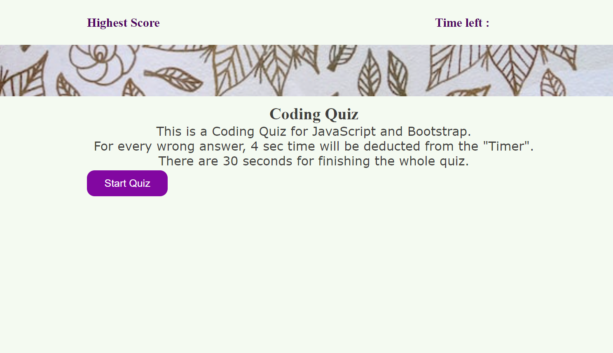
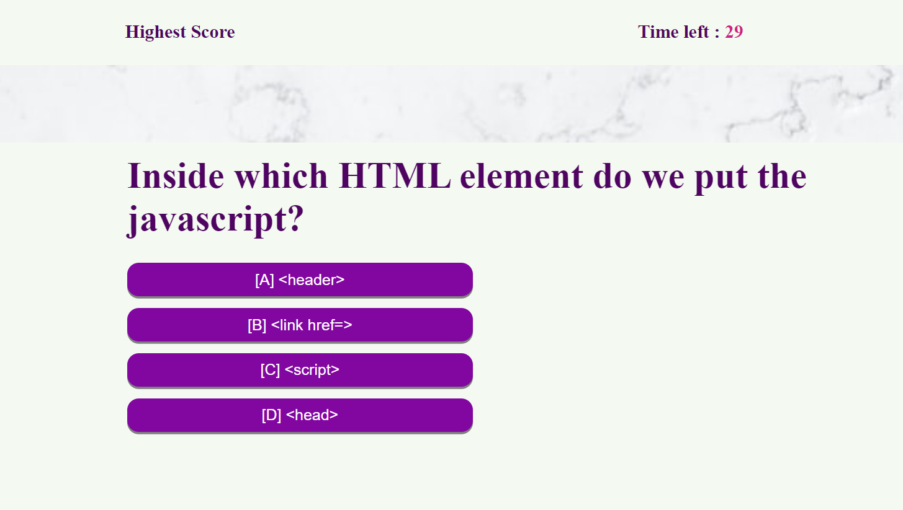
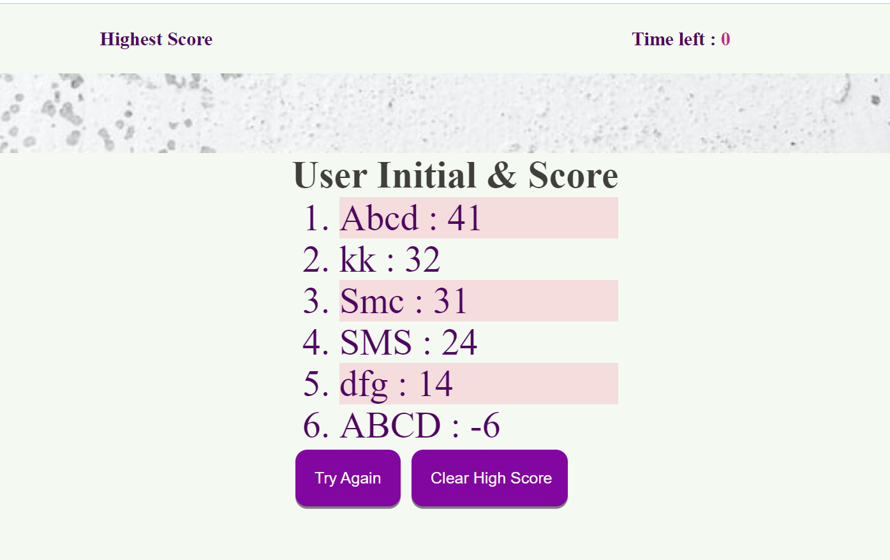

# WApi_QuizGen

## Description

This is the fourth challenge for UC Berkley coding boot camp which is a coding quiz application. 
- I named the challenge "WApi_QuizGen” because I needed the concept of web APIs     for this homework.
- This challenge emphasized the use of JavaScript to provide questions and collect user inputs to determine whether the answer is correct or wrong. There is a timer decreasing gradually unless the user chooses the wrong input. Every wrong input deducts some time from the main timer. The final score is the user's score.
- This project helped me to learn more about how to use logic in JavaScript and different types of API uses.
 
## Installation

To run the application successfully, we need Microsoft Visual Studio as an editor, Git Bash to clone the github repo and Chrome Dev Tools to inspect the code.

## Task 

-	HTML and CSS is used to design the interface.
-	JavaScript documents helped to create the coding quiz with multiple-choice questions.
-	This homework emphasized the importance of using JavaScript web APIs to make dynamic changes to an HTML document.
-	Different event listeners and functions were implemented for user convenience.

## Usage

To see my homework, please go to : https://thalim-glam.github.io/WaPi_quizGen/

Here is a sample screenshot showing partial view og my project




## Comand line code

I used a lot of git commands like :
- git status
- git add -A
- git commit -m "Comment goes here"
- git branch
- git push
- git pull origin main
- git checkout main
- git checkout -b feature/add-branch

## Credits

Apart from me :D the credit also goes to my Instructor, TAs, Tutor, Classmates, and 
- Google (my guide everytime I got stuck and lost!)
- Geeks for Geeks
- Stack Overflow
- MDN web doc
- Github docs
- Tutorials Teacher

## User Story

```
AS A coding boot camp student
I WANT to take a timed quiz on JavaScript fundamentals that stores high scores
SO THAT I can gauge my progress compared to my peers
```

## Acceptance Criteria

```
GIVEN I am taking a code quiz
WHEN I click the start button
THEN a timer starts and I am presented with a question
WHEN I answer a question
THEN I am presented with another question
WHEN I answer a question incorrectly
THEN time is subtracted from the clock
WHEN all questions are answered or the timer reaches 0
THEN the game is over
WHEN the game is over
THEN I can save my initials and score
```
## License

MIT Lisence
---

## Badges


## Features

In my code I had 1 main branch and crated a few featured branch to test my code and update.
  - I had to create everything from the scratch
  - Added the screenshot and 
  - Used console.log and inspect to debug my work

## How to Contribute

I followed this https://coding-boot-camp.github.io/full-stack/github/professional-readme-guide as my guidelines to how to write a README file.
I also did tutoring session to understand the homework better.
The TAs were very supportive and guided me a lot.

## Tests

To test the homework, 
  - Please follow the deployed website link. 
  - Click the "START" button to start the quiz.
  - You can test the quiz different ways.
  - You can check the "Console" to see some of my checking messages.
  - I have put lots of comments inside the my code for my understanding.s

### Done By: Tasneem Halim
